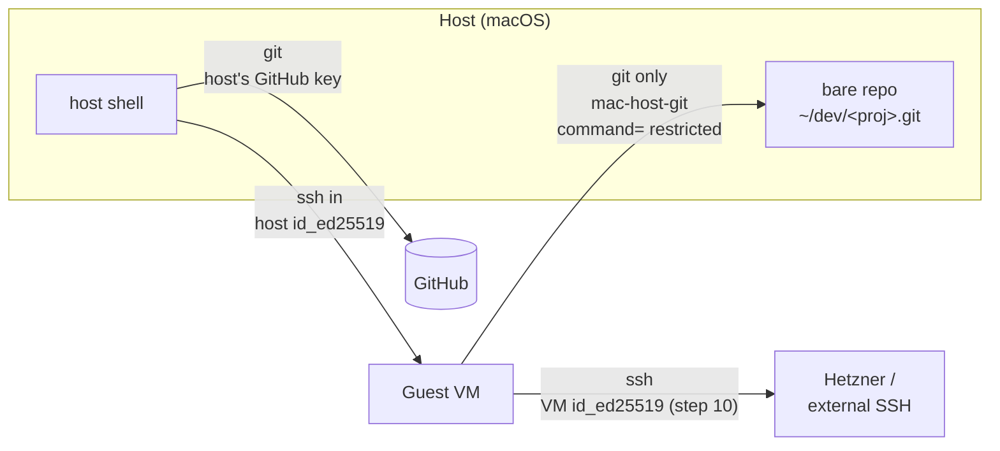
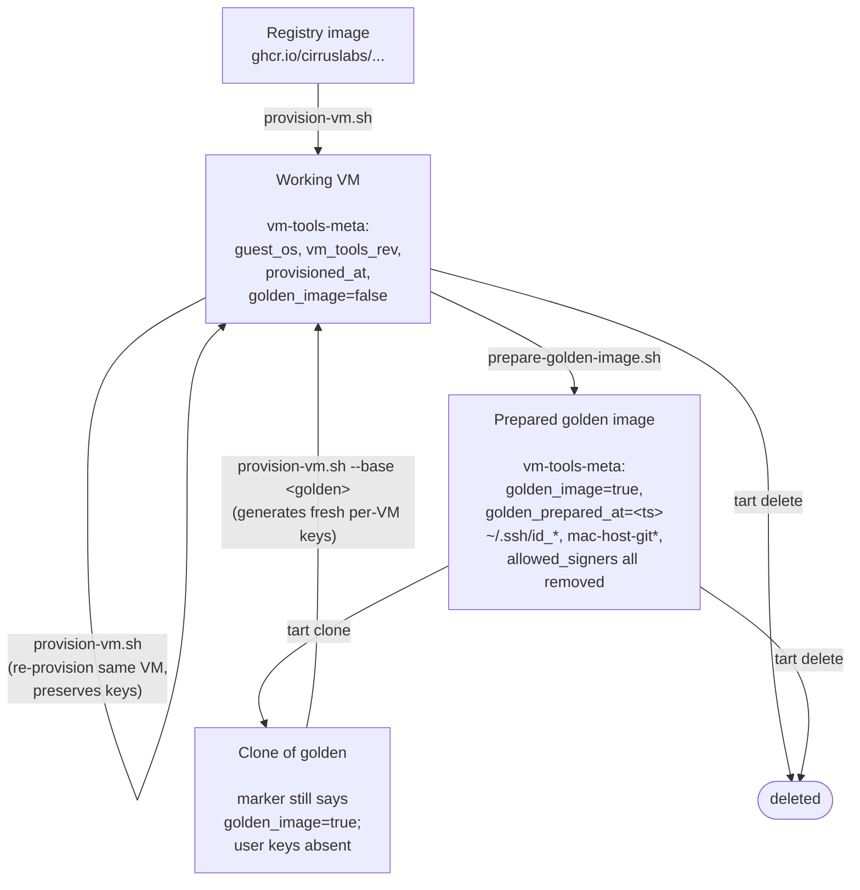

# host-tools

Scripts for managing macOS and Linux VMs using **Tart** (Apple Silicon), provisioning dev environments, and secure git workflows between host and guest. All scripts run on the **host machine**.

## Key Conventions

- `set -euo pipefail` in all scripts
- Color codes: `RED`, `GREEN`, `YELLOW`, `BLUE`, `NC` (reset)
- Scripts with optional VM name argument use `lib/pick-vm.sh` for interactive selection
- Steps that can fail on re-run should be idempotent (check-then-act pattern with yellow `!` for skipped, green `✓` for done)

## tart exec Gotchas

- Runs as `admin` user (passwordless sudo). For user context: `sudo -Hu <user> zsh -l -c '...'`
- Does NOT support `--` separator — treats it as the command name
- Minimal PATH excludes `/sbin` — use full paths (e.g., `/sbin/reboot`)
- Can hang when VM reboots (guest agent dies) — run reboot in background subshell with timeout
- Only used post-reboot for GUI commands (`open`, `osascript`) and guest agent verification
- Early provisioning uses SSH via `sshpass` for both macOS and Linux (vanilla image has no guest agent)

## SSH Security Model

The git workflow (`bridge-vm-git.sh`) uses a layered SSH architecture:

- **Host→VM**: Standard SSH key auth. The host's `~/.ssh/id_ed25519.pub` is installed to the VM during provisioning. No agent forwarding.
- **VM→Host** (git only): VM generates its own dedicated key (`~/.ssh/mac-host-git`). The host's `authorized_keys` restricts this key with `command=`, `no-agent-forwarding`, `no-port-forwarding`, `no-pty` — only `git-upload-pack`/`git-receive-pack` on specific bare repos.
- **VM→external** (Hetzner, etc.): VM generates its own `~/.ssh/id_ed25519` during `provision-vm.sh` (after step 10). Used for outbound SSH the VM initiates — e.g. kamal deploys to Hetzner.
- **Host→GitHub**: Uses the user's own SSH key (configured in `~/.ssh/config` for `github.com`). VMs never connect to GitHub directly.
- **Remote URLs**: Both scripts use SSH URLs (`git@github.com:`) for GitHub remotes on bare repos.

Read this diagram as: VMs never talk to GitHub directly. The bare repo on the host is the bridge — VMs push/pull to it via the restricted `mac-host-git` key, and the host then pushes/pulls between the bare repo and GitHub using its own GitHub SSH key. Outbound from the VM (Hetzner deploys, etc.) goes through `~/.ssh/id_ed25519` generated per-VM during provisioning.

**Git signing** (separate from SSH auth): step `[14/23]` of `provision-vm.sh` generates `~/.ssh/id_ed25519_signing`, registers its pubkey in `~/.config/git/allowed_signers`, and configures git to use SSH-format signing. The signing key signs `git tag -s` / `git commit -S` outputs; verification reads the pubkey from `allowed_signers`. Each VM gets its own per-VM signing key.

## Provisioning Notes

- Base images: `macos-tahoe-vanilla` (macOS), `debian:trixie` (default Linux), `ubuntu:24.04` (Linux with `--ubuntu`); all from Cirrus Labs
- `--ubuntu` flag selects Ubuntu 24.04 instead of Debian Trixie for Linux VMs (implies `--linux`). Recommended for `--android` due to better emulator compatibility (glibc, tested by Google)
- All early provisioning uses SSH via `sshpass -p admin` (both macOS and Linux)
- `sysadminctl -addUser` disrupts admin SSH auth — all step 8 macOS commands run in a single SSH session, then subsequent steps use the new user's key-based auth
- SSH options split: `SSH_PASS` (password auth, PubkeyAuthentication=no) for admin, `SSH_KEY` (key auth, IdentitiesOnly=yes) for user
- Homebrew installed fresh (auto-installs Xcode CLT, providing git); no ownership transfer needed
- `GIT_CONFIG_COUNT` env vars in `vm_exec_user` disable osxkeychain credential helper (fails over non-interactive SSH)
- Brew taps (`xcodesorg/made`, `cirruslabs/cli`) are pre-cloned via direct `git clone` — brew's internal git doesn't inherit `GIT_CONFIG_COUNT`, so `brew tap` fails with credential helper errors
- Xcode installed via `sudo -E xcodes install` with `--experimental-unxip`; credentials via `XCODES_USERNAME`/`XCODES_PASSWORD` env vars; `--no-xcode` to skip, `--xcode-version` to pin
- `xcode-select -s` pointed to installed Xcode app (xcodes names it `Xcode-<ver>.app`)
- Step `[14/23]` sets up git SSH signing: generates `~/.ssh/id_ed25519_signing` (passphrase prompted upfront, passed via `-N`), configures git for `gpg.format=ssh` + `user.signingkey` + `gpg.ssh.allowedSignersFile`, writes `~/.config/git/allowed_signers` from `user.email` + signing pubkey. `--no-signing` to skip; `--non-interactive` implies skip. Idempotent — preserves existing key on re-provisions.
- VM metadata: `provision-vm.sh` writes `~/.tart/vms/<name>/vm-tools-meta` (host-side, propagates under `tart clone`); `prepare-golden-image.sh` flips `golden_image=true`; `provision-vm.sh` warns at the top if `LOCAL_BASE` is true and the base isn't a prepared golden image (user keys may be inherited). `resize-vm-disk.sh`, `run-vm.sh`, `prepare-golden-image.sh`, and `provision-vm.sh` (when `LOCAL_BASE=true`) all read `guest_os` from this marker, so `--linux` is only needed when the marker is absent (legacy VMs) or to override.
- tart-guest-agent installed via brew; requires two launchd plists (from `cirruslabs/macos-image-templates`): LaunchDaemon (`--run-daemon`, handles `tart exec`) + LaunchAgent (`--run-agent`, handles clipboard)
- SSH host keys are regenerated so cloned VMs get unique identities
- macOS auto-login: `sysadminctl -autologin set` via `tart exec` (must run post-reboot — Virtio channel needs a full boot cycle; fails over SSH with error:22 due to XPC not being accessible)
- `--android` flag installs Android dev tools. macOS: Android Studio (brew cask), Java 21 (mise), cmdline-tools (direct zip), SDK components + emulator + system images. Linux: XFCE desktop + LightDM with GTK greeter (autologin), IntelliJ IDEA CE (native ARM64 tar.gz to /opt/idea-IC), Java 21 (mise), cmdline-tools (Linux zip), SDK components (no emulator — runs on host). Linux Android VMs get 4 CPUs, 8 GB RAM, 1920x1200 display.
- The Android emulator runs on the **host**, not inside VMs (Apple blocks nested virt for macOS guests; Linux emulator segfaults on ARM64). Use `start-android-dev.sh` on the host to manage the emulator and optionally bridge to a VM or sandbox.
- `run-vm.sh` defaults to non-suspendable mode (audio works); `--suspendable` flag enables suspend/resume (macOS only, disables audio)
- `run-vm.sh` supports `--nested` flag to enable nested virtualization (passes `--nested` to `tart run`)

## VM Lifecycle

A guest VM's directory under `~/.tart/vms/<name>/` carries a `vm-tools-meta` marker that distinguishes the four states it can be in. `provision-vm.sh` writes the marker on first provisioning; `prepare-golden-image.sh` flips `golden_image=true` and `golden_prepared_at`; `tart clone` copies the whole directory (marker included).

Reading the diagram: the only loop is **Working → Working** (re-provisioning a VM in place; idempotent keygen preserves existing keys). The clone-then-provision path always lands fresh keys because `prepare-golden-image.sh` cleared them on the way out. `provision-vm.sh` warns at the top if `LOCAL_BASE=true` but the base's marker says `golden_image=false` (meaning either an unpaired re-provision *or* a base that was never run through `prepare-golden-image.sh` — the latter is the case the warning is really for, since it would silently inherit user keys).

## Sandboxed Android Development

Android emulator/device cannot run inside VMs on Apple Silicon (no nested virt in macOS guests; Linux emulator segfaults; Cuttlefish too slow). The emulator runs on the host; the AI agent runs in a sandbox.

### Recommended approaches (in priority order)

1. **sandbox-runtime (Option 2)** — Best RN experience. Everything on one machine. `claude --sandbox --allowLocalBinding`. Metro, ADB, debugger all work normally. Seatbelt restricts file access + network filtering blocks exfiltration.
2. **Physical device (Option 3)** — Eliminates emulator. `adb reverse tcp:8081 tcp:8081` works natively. Screen mirror via `scrcpy`.
3. **Tart VM (Option 1)** — Strongest isolation but degraded RN debugging. Agent in VM, emulator on host, socat bridges Metro port. `adb reverse` requires workaround. React Native DevTools broken by default.

### `start-android-dev.sh`

Host-side script that manages the emulator and ADB bridging:
- `start-android-dev.sh` — start emulator for sandbox-runtime use (default)
- `start-android-dev.sh --bridge <vm>` — start emulator + socat bridge to a Tart VM
- `start-android-dev.sh --device` — set up ADB reverse for a physical device
- `start-android-dev.sh --avd <name>` — specify which AVD to launch
- `start-android-dev.sh --wipe` — wipe emulator data before starting

### React Native in VM (Option 1) gotchas

- Metro must bind to `0.0.0.0`: `npx react-native start --host 0.0.0.0`
- Set `REACT_NATIVE_PACKAGER_HOSTNAME` to VM IP or `0.0.0.0`
- `adb reverse` forwards to ADB server (host), not ADB client (VM) — socat on host bridges Metro port
- `npx react-native run-android` assumes co-located Metro + ADB — decompose into manual build + install steps
- React Native DevTools/debugger WebSocket URLs contain wrong addresses when Metro is remote
- Set `ANDROID_ADB_SERVER_ADDRESS=<host-ip>` in VM to use host's ADB server

- Gatekeeper quarantine stripped from VS Code and iTerm2 after bootstrap (and Android Studio when `--android`)
- VM timezone synced from host (both macOS and Linux, including local base re-provisions)
- Reboot triggered via SSH; guest agent verified via `tart exec` after reboot
- GUI commands (iTerm2 `open`/`osascript`) use `vm_exec_gui` (tart exec) post-reboot
- Cleanup on failure removes VM IP from `~/.ssh/known_hosts`
